# HR Portal — Functioneel Ontwerp & Datamodel

**Status:** Concept — wacht op goedkeuring. Er is nog geen code gegenereerd.
**Versie:** 0.1
**Datum:** 2026-07-20

Dit document beschrijft het functioneel ontwerp, rollen- en rechtenmodel, navigatiestructuur, datamodel (ERD), database-/Supabase-schema, security-model, RLS-ontwerp, API-architectuur en fasenroadmap voor de HR Portal. Pas na expliciete goedkeuring van dit document wordt code gegenereerd.

---

## 1. Functioneel Ontwerp

### 1.1 Doel
Eén centrale, veilige portal waarin alle personeelsinformatie van het bedrijf wordt vastgelegd en beheerd: personeelsdossiers, contracten, salaris, roosters, overuren, verlof en verzuim. De portal is het fundament voor een later uit te breiden HR-platform (medewerkers-app, declaraties, AFAS-koppeling, workflow-automatisering, rapportages).

### 1.2 Uitgangspunten
- Eén bedrijf, Nederland, ~10 medewerkers nu — schaalbaar naar meer medewerkers en (later) meerdere organisaties.
- Geen CAO nu, maar regels (opbouw, pauzes, overuren) zijn **instelbaar** in plaats van hard-coded, zodat een CAO later kan worden toegevoegd zonder schema-wijziging.
- Desktop-first, responsive, snel te doorzoeken en te filteren.
- Elke module is nu al zo ontworpen dat de toekomstige medewerkers-app, declaratiemodule en AFAS-koppeling er zonder herontwerp op kunnen aansluiten (zelfde tabellen, uitgebreid met een client-laag).
- Multi-tenant-vriendelijk datamodel (`organizations` als root-entiteit) zodat het product later als SaaS voor meerdere bedrijven ingezet kan worden, zonder dat dit nu al gebruikt hoeft te worden.

### 1.3 Scope MVP (deze aanvraag)
Functioneel ontwerp, rollenmodel, navigatiestructuur, ERD, database-schema, Supabase-schema, security-model, RLS-ontwerp, API-architectuur en roadmap. **Geen code.**

### 1.4 Modules (samenvatting)
| # | Module | Kern |
|---|--------|------|
| 1 | Personeelsdossier | Persoonlijke, privé- en werkgegevens, met wijzigingshistorie |
| 2 | Contractbeheer | Meerdere contracten per medewerker, volledige historie |
| 3 | Documentbeheer | Supabase Storage, versiebeheer, gekoppeld aan medewerker |
| 4 | Salarisbeheer | Salarishistorie + visuele ontwikkeling |
| 5 | Roosters | Contractrooster + historische roosters + pauzeregels |
| 6 | Overuren | Automatische berekening, workflow met statussen |
| 7 | Verlofbeheer | Opbouw wettelijk/bovenwettelijk, jaarverwerking |
| 8 | Verzuim | Basisregistratie + dashboard, voorbereid op Poortwachter |
| 9 | Dashboards | Medewerker- en HR-dashboard |
| 10 | Medewerkers-app (voorbereiding) | Verlofaanvragen, overuren, declaraties |
| 11 | AFAS-voorbereiding | Integratielaag, mappings, services |
| 12 | E-mail | Resend, centrale notificatieservice |

---

## 2. Gebruikersrollen en rechtenmodel

### 2.1 Rollen
- **Beheerder (admin)** — volledige toegang, gebruikers- en instellingenbeheer.
- **HR** — volledige toegang tot alle medewerkergegevens, contracten, salaris, verlof, overuren, rapportages. Geen systeeminstellingen/gebruikersbeheer.
- **Leidinggevende (manager)** — toegang tot medewerkers waarvan hij/zij de leidinggevende is (`employees.manager_id`). Kan dossiers bekijken, verlof en overuren goedkeuren. **Geen** toegang tot salarisgegevens.
- **Medewerker (employee)** — uitsluitend eigen gegevens. Kan (via toekomstige app, API nu al voorbereid) verlof/overuren/declaraties indienen en eigen documenten bekijken.

### 2.2 Rechtenmatrix (samenvatting)

| Object | Beheerder | HR | Leidinggevende | Medewerker |
|---|---|---|---|---|
| Personeelsdossier (alle) | CRUD | CRUD | R (eigen team) | — |
| Personeelsdossier (eigen) | CRUD | CRUD | R | R (+ beperkt U op contactgegevens) |
| Contract — basisgegevens (uren, type, data) | CRUD | CRUD | R (eigen team) | R (eigen) |
| Contract — salaris/schaal | CRUD | CRUD | — | — |
| Salarishistorie | CRUD | CRUD | — | — |
| Documenten | CRUD | CRUD | R (eigen team, niet-gevoelige categorieën) | R (eigen) |
| Roosters | CRUD | CRUD | R/U (eigen team) | R (eigen) |
| Overuren | CRUD | CRUD (incl. verwerking) | R/U-goedkeuring (eigen team) | C/R (eigen, indienen) |
| Verlof | CRUD | CRUD | R/U-goedkeuring (eigen team) | C/R (eigen, aanvragen) |
| Verzuim (volledig dossier) | CRUD | CRUD | R (status/periode, geen medische details) | R (eigen) |
| Declaraties (toekomst) | CRUD | CRUD | R-goedkeuring (eigen team) | C/R (eigen) |
| Rapportages/dashboards | Alle | Alle | Eigen team (geen salaris) | Eigen gegevens |
| Gebruikersbeheer & instellingen | CRUD | — | — | — |
| Audit log | R | R (eigen modules) | — | — |

> Ontwerpbeslissing: salarisgegevens staan in een **apart, strenger beveiligd deel van het datamodel** (zie §5.3) zodat een leidinggevende wél contracturen/rooster van zijn team kan zien (nodig voor planning/overuren), maar nooit het salaris — zonder dat dit een aparte kopie van contractdata vereist.

---

## 3. Navigatiestructuur

Desktop-first met vast linkermenu; content-gebied met kaarten/tabellen/filters. Menu-items worden per rol getoond/verborgen (niet alleen via UI, ook server-side afgedwongen via RLS).

```
Dashboard
├─ Mijn gegevens (medewerker: enige ingang)
│   ├─ Persoonlijke gegevens
│   ├─ Contract & rooster
│   ├─ Documenten
│   ├─ Verlofsaldo & aanvragen
│   ├─ Overuren
│   └─ Declaraties (fase 10, UI later)
│
├─ Medewerkers (HR, Beheerder, Leidinggevende — gefilterd op scope)
│   ├─ Overzicht (zoek + filters: afdeling, status, contract afloop, verjaardag)
│   ├─ Dossier detail
│   │   ├─ Persoonlijk · Privé · Werk
│   │   ├─ Contracten & historie
│   │   ├─ Salarisontwikkeling (verborgen voor leidinggevende)
│   │   ├─ Documenten
│   │   ├─ Rooster & overuren
│   │   ├─ Verlof
│   │   └─ Verzuim
│   └─ Nieuwe medewerker (HR/Beheerder)
│
├─ Verlof
│   ├─ Aanvragen ter goedkeuring (leidinggevende/HR)
│   ├─ Verlofoverzicht team/organisatie
│   └─ Jaarverwerking & signalen (HR/Beheerder)
│
├─ Overuren
│   ├─ Ter goedkeuring
│   ├─ Aan te bieden aan salarisadministratie
│   └─ Overzicht per medewerker/periode
│
├─ Verzuim
│   ├─ Actuele ziekmeldingen
│   └─ Verzuimdashboard
│
├─ Rapportages (HR/Beheerder)
│
├─ Instellingen (Beheerder)
│   ├─ Gebruikers & rollen
│   ├─ Afdelingen
│   ├─ Pauzeregels
│   ├─ Verlofregels (opbouwfactoren, CAO-placeholder)
│   ├─ Overuren-percentages
│   ├─ E-mailsjablonen (Resend)
│   └─ Integraties (AFAS — voorbereiding)
│
└─ Audit log (Beheerder, HR read-only eigen modules)
```

---

## 4. Datamodel (ERD)

Ontwerpprincipe: elke tabel hangt (direct of indirect) onder `organizations`, ook al bestaat er nu maar één rij — dit maakt het model later multi-tenant zonder migratie van de kernstructuur. Persoonsgegevens die moeten wijzigen mét historie (adres, contact) staan in aparte historische tabellen; overige wijzigingen op medewerkergegevens lopen via de generieke `audit_log`.

```mermaid
erDiagram
    ORGANIZATIONS ||--o{ DEPARTMENTS : heeft
    ORGANIZATIONS ||--o{ EMPLOYEES : heeft
    ORGANIZATIONS ||--o{ LEAVE_TYPES : configureert
    ORGANIZATIONS ||--o{ BREAK_RULES : configureert
    ORGANIZATIONS ||--o{ ORG_SETTINGS : heeft

    DEPARTMENTS ||--o{ EMPLOYEES : "medewerkers in"
    EMPLOYEES ||--o{ EMPLOYEES : "leidinggevende van"
    EMPLOYEES ||--|| PROFILES : "gekoppeld aan auth-user"

    EMPLOYEES ||--o{ EMPLOYEE_ADDRESSES : historie
    EMPLOYEES ||--o{ EMPLOYEE_CONTACT_DETAILS : historie
    EMPLOYEES ||--o| EMPLOYEE_PRIVATE_DETAILS : heeft
    EMPLOYEES ||--o{ EMPLOYEE_CHILDREN : heeft

    EMPLOYEES ||--o{ CONTRACTS : heeft
    CONTRACTS ||--|| CONTRACT_COMPENSATION : "1:1 salaris (afgeschermd)"
    EMPLOYEES ||--o{ SALARY_HISTORY : heeft

    EMPLOYEES ||--o{ DOCUMENTS : heeft
    DOCUMENTS ||--o{ DOCUMENT_VERSIONS : heeft

    EMPLOYEES ||--o{ SCHEDULE_PERIODS : heeft
    SCHEDULE_PERIODS ||--o{ SCHEDULE_DAYS : bevat

    EMPLOYEES ||--o{ OVERTIME_ENTRIES : heeft

    LEAVE_TYPES ||--o{ LEAVE_BALANCES : bepaalt
    LEAVE_TYPES ||--o{ LEAVE_TRANSACTIONS : bepaalt
    EMPLOYEES ||--o{ LEAVE_BALANCES : heeft
    EMPLOYEES ||--o{ LEAVE_TRANSACTIONS : heeft
    EMPLOYEES ||--o{ LEAVE_REQUESTS : dient_in
    LEAVE_REQUESTS ||--o{ LEAVE_TRANSACTIONS : genereert

    EMPLOYEES ||--o{ ABSENCE_RECORDS : heeft

    EMPLOYEES ||--o{ EXPENSE_CLAIMS : dient_in

    EMPLOYEES ||--o{ AUDIT_LOG : "wordt gelogd"
    PROFILES ||--o{ AUDIT_LOG : "voert wijziging uit"

    EMPLOYEES ||--o{ INTEGRATION_MAPPINGS : "AFAS-koppeling"
```



> Ter leesbaarheid toont het diagram entiteiten en relaties, niet elk attribuut. Volledige kolomdefinities staan in §5.

---

## 5. Database-schema (Supabase/PostgreSQL)

Alle tabellen: `id uuid primary key default gen_random_uuid()`, `created_at timestamptz default now()`, `updated_at timestamptz`, en waar relevant `deleted_at timestamptz` (soft delete) — deze standaardkolommen worden hieronder niet herhaald per tabel, behalve waar functioneel relevant.

### 5.1 Organisatie & structuur

**organizations**
| Kolom | Type | Omschrijving |
|---|---|---|
| name | text | Bedrijfsnaam |
| kvk_number | text | KvK-nummer |
| address | text | Vestigingsadres |
| settings | jsonb | Vrije instellingen (fallback naast `org_settings`) |

**departments**
| Kolom | Type | Omschrijving |
|---|---|---|
| organization_id | uuid FK | |
| name | text | |
| parent_department_id | uuid FK (self) | Voor toekomstige sub-afdelingen |

**org_settings** — generieke, per-organisatie instelbare regels (pauzes, verlofopbouw, overurenpercentages, CAO-placeholder)
| Kolom | Type | Omschrijving |
|---|---|---|
| organization_id | uuid FK | |
| category | text | bv. `break_rules`, `leave_accrual`, `overtime` |
| key | text | |
| value | jsonb | |

### 5.2 Identiteit & rollen

**profiles** — 1:1 met `auth.users`
| Kolom | Type | Omschrijving |
|---|---|---|
| id | uuid PK | = `auth.users.id` |
| organization_id | uuid FK | |
| employee_id | uuid FK, nullable | null bij systeemaccount |
| role | enum: admin, hr, manager, employee | |
| is_active | boolean | |

### 5.3 Personeelsdossier

**employees**
| Kolom | Type | Omschrijving |
|---|---|---|
| organization_id | uuid FK | |
| employee_number | text | Uniek personeelsnummer |
| first_name, insertion, last_name, preferred_name | text | Voornaam, tussenvoegsel, achternaam, roepnaam |
| gender | enum | man/vrouw/anders/onbekend |
| date_of_birth | date | |
| bsn_encrypted | bytea | **Versleuteld** (zie §7.2), nooit plain text |
| iban | text | |
| department_id | uuid FK | |
| manager_id | uuid FK (self) | Bepaalt scope leidinggevende |
| job_title | text | Functie |
| employment_start_date | date | Datum indiensttreding |
| employment_end_date | date, nullable | Datum uitdiensttreding |
| is_active | boolean | Afgeleid, maar expliciet kolom t.b.v. snelle filters |
| user_id | uuid FK → profiles.id | nullable tot account is aangemaakt |

**employee_addresses** (historie)
| Kolom | Type | Omschrijving |
|---|---|---|
| employee_id | uuid FK | |
| street, postal_code, city | text | |
| valid_from, valid_to | date | `valid_to null` = huidig |

**employee_contact_details** (historie)
| Kolom | Type | Omschrijving |
|---|---|---|
| employee_id | uuid FK | |
| phone, email | text | |
| emergency_contact_name, emergency_contact_phone | text | |
| valid_from, valid_to | date | |

**employee_private_details**
| Kolom | Type | Omschrijving |
|---|---|---|
| employee_id | uuid FK, uniek | 1:1 |
| partner_name | text | |
| partner_date_of_birth | date | |
| hobbies, interests | text | |
| notes | text | Persoonlijke notities |

**employee_children**
| Kolom | Type | Omschrijving |
|---|---|---|
| employee_id | uuid FK | |
| name | text | |
| date_of_birth | date | |

> Wijzigingen op bovenstaande tabellen (behalve historie-tabellen die zelf al historisch zijn) worden aanvullend vastgelegd in `audit_log` (oude/nieuwe waarde, wie, wanneer).

### 5.4 Contractbeheer & salaris

**contracts**
| Kolom | Type | Omschrijving |
|---|---|---|
| employee_id | uuid FK | |
| contract_number | text | |
| start_date, end_date | date | |
| contract_type | enum | bepaalde tijd / onbepaalde tijd / oproep / stage / etc. |
| hours_per_week | numeric | Basis voor contractrooster, verlofopbouw en overuren |
| notes | text | |

**contract_compensation** — bewust **gescheiden** van `contracts` zodat RLS salaris kan afschermen zonder de leidinggevende de contracturen te ontzeggen
| Kolom | Type | Omschrijving |
|---|---|---|
| contract_id | uuid FK, uniek | 1:1 met contract |
| salary_amount | numeric | |
| salary_scale | text | |

**salary_history**
| Kolom | Type | Omschrijving |
|---|---|---|
| employee_id | uuid FK | |
| change_date | date | |
| old_salary, new_salary | numeric | |
| absolute_difference | numeric | Berekend bij insert |
| percentage_increase | numeric | Berekend bij insert |
| reason | text | |
| changed_by | uuid FK → profiles.id | |

### 5.5 Documentbeheer

**documents**
| Kolom | Type | Omschrijving |
|---|---|---|
| employee_id | uuid FK | |
| category | enum | arbeidsovereenkomst, addendum, id_document, certificaat, functioneringsgesprek, beoordelingsgesprek, verzuimdocument, overig |
| current_version_id | uuid FK → document_versions.id | |
| created_by | uuid FK | |

**document_versions**
| Kolom | Type | Omschrijving |
|---|---|---|
| document_id | uuid FK | |
| version_number | int | |
| storage_path | text | Pad in Supabase Storage bucket `documents` |
| file_name | text | |
| uploaded_by | uuid FK | |
| uploaded_at | timestamptz | |

### 5.6 Roosters

**break_rules**
| Kolom | Type | Omschrijving |
|---|---|---|
| organization_id | uuid FK | |
| min_hours | numeric | Grens (bv. 5,5 uur) |
| deduction_minutes | int | Aftrek (bv. 30 min) |
| sort_order | int | Bepaalt volgorde van toepassing bij meerdere regels |

**schedule_periods** (historische roosters per periode; huidig rooster = periode zonder `end_date`)
| Kolom | Type | Omschrijving |
|---|---|---|
| employee_id | uuid FK | |
| start_date | date | |
| end_date | date, nullable | |

**schedule_days**
| Kolom | Type | Omschrijving |
|---|---|---|
| schedule_period_id | uuid FK | |
| weekday | int (0–6) | |
| start_time, end_time | time | |
| computed_hours | numeric, generated | (eind − start) − toegepaste pauzeregel |

### 5.7 Overuren

**overtime_entries**
| Kolom | Type | Omschrijving |
|---|---|---|
| employee_id | uuid FK | |
| period_start, period_end | date | |
| worked_hours | numeric | Uit `schedule_days` opgeteld |
| contract_hours | numeric | Uit `contracts.hours_per_week`, naar rato periode |
| overtime_hours | numeric, generated | `worked_hours − contract_hours` |
| status | enum | geregistreerd, goedgekeurd, aangeboden_salarisadministratie, verwerkt, uitbetaald, tijd_voor_tijd |
| payout_percentage | enum | 100, 125, 150, 200 (alleen relevant bij uitbetaling) |
| approved_by | uuid FK, nullable | |
| notes | text | |

### 5.8 Verlofbeheer

**leave_types**
| Kolom | Type | Omschrijving |
|---|---|---|
| organization_id | uuid FK | |
| name | text | bv. "Wettelijk verlof", "Bovenwettelijk verlof" |
| is_statutory | boolean | Wettelijk ja/nee |
| accrual_factor | numeric | bv. 4× (wettelijk) of 1× (bovenwettelijk) contracturen/week per jaar — instelbaar t.b.v. toekomstige CAO |

**leave_balances** (jaarlijks saldo per medewerker/verloftype — gematerialiseerd overzicht, afgeleid van `leave_transactions`)
| Kolom | Type | Omschrijving |
|---|---|---|
| employee_id | uuid FK | |
| leave_type_id | uuid FK | |
| year | int | |
| accrued_hours | numeric | Opgebouwd |
| taken_hours | numeric | Opgenomen |
| remaining_hours | numeric, generated | `accrued − taken` |

**leave_transactions** (ledger — bron van waarheid)
| Kolom | Type | Omschrijving |
|---|---|---|
| employee_id | uuid FK | |
| leave_type_id | uuid FK | |
| transaction_date | date | |
| hours | numeric | Positief (opbouw/correctie) of negatief (opname) |
| transaction_type | enum | opbouw, opname, correctie, jaarovergang |
| leave_request_id | uuid FK, nullable | |

**leave_requests**
| Kolom | Type | Omschrijving |
|---|---|---|
| employee_id | uuid FK | |
| leave_type_id | uuid FK | |
| start_date, end_date | date | |
| hours | numeric | |
| status | enum | aangevraagd, goedgekeurd, afgewezen, ingetrokken |
| approver_id | uuid FK, nullable | |
| requested_at | timestamptz | |

> Jaarverwerking (1 januari nieuw verlofjaar, 1 juli wettelijke-verlof-check) draait als Supabase Edge Function / scheduled job en schrijft naar `leave_transactions` + genereert notificaties.

### 5.9 Verzuim

**absence_records**
| Kolom | Type | Omschrijving |
|---|---|---|
| employee_id | uuid FK | |
| first_sick_day | date | |
| is_full_time_absence | boolean | Volledig/gedeeltelijk ziek |
| incapacity_percentage | numeric | |
| recovery_date | date, nullable | |
| status | enum | actief, hersteld, gedeeltelijk_hersteld |
| notes | text | |

> Structuur is bewust plat gehouden voor de MVP, maar `status` en losse notitievelden laten zich zonder migratie uitbreiden met een `absence_timeline`-tabel voor Poortwachter-stappen (probleemanalyse, plan van aanpak, evaluaties) in een latere fase.

### 5.10 Toekomstige medewerkers-app (schema nu al aanwezig)

**expense_claims**
| Kolom | Type | Omschrijving |
|---|---|---|
| employee_id | uuid FK | |
| amount | numeric | |
| description | text | |
| receipt_storage_path | text | Bon-foto in Supabase Storage bucket `receipts` |
| status | enum | ingediend, goedgekeurd, afgewezen, betaald |
| payment_date | date, nullable | |

> `leave_requests` en `overtime_entries` (zie boven) zijn al de tabellen die de medewerkers-app rechtstreeks gebruikt — er is geen apart schema nodig wanneer de app gebouwd wordt, enkel een cliënt (React Native/PWA) die dezelfde Supabase-API aanspreekt.

### 5.11 E-mail / notificaties

**notification_log**
| Kolom | Type | Omschrijving |
|---|---|---|
| type | enum | verlof_aangevraagd, verlof_goedgekeurd, verlof_afgewezen, overuren_ingediend, overuren_goedgekeurd, overuren_aangeboden, overuren_verwerkt |
| recipient_email | text | |
| related_table, related_id | text, uuid | Generieke koppeling |
| status | enum | verzonden, mislukt |
| resend_message_id | text | |
| sent_at | timestamptz | |

### 5.12 AFAS-voorbereiding

**integration_mappings**
| Kolom | Type | Omschrijving |
|---|---|---|
| system | text | `afas` |
| local_table, local_id | text, uuid | |
| external_id | text | AFAS-sleutel |

**integration_sync_log**
| Kolom | Type | Omschrijving |
|---|---|---|
| system | text | |
| direction | enum | inbound, outbound |
| entity | text | |
| status | enum | success, failed, pending |
| payload | jsonb | |
| synced_at | timestamptz | |

### 5.13 Audit logging (generiek, voor alle modules)

**audit_log**
| Kolom | Type | Omschrijving |
|---|---|---|
| organization_id | uuid FK | |
| table_name | text | |
| record_id | uuid | |
| action | enum | insert, update, delete |
| old_data | jsonb | |
| new_data | jsonb | |
| changed_by | uuid FK → profiles.id | |
| module | text | bv. `salaris`, `contract`, `verlof`, `verzuim`, `overuren`, `personeelsgegevens` |
| changed_at | timestamptz | |

Wordt gevuld via PostgreSQL-triggers op de betreffende tabellen (niet vanuit de applicatielaag), zodat logging niet te omzeilen is.

---

## 6. Supabase-schema (platform-inrichting)

### 6.1 Auth
- Supabase Auth (email/wachtwoord, uitbreidbaar met magic link/SSO later).
- 1 `auth.users`-rij per gebruiker → 1 `profiles`-rij (rol + koppeling aan `employees`).
- Nieuwe medewerker aanmaken (HR/Beheerder) triggert optioneel een uitnodigingsmail (Resend) met Supabase invite-link.

### 6.2 Storage
| Bucket | Toegang | Inhoud |
|---|---|---|
| `documents` | privé, RLS via signed URLs | Contracten, ID, certificaten, gespreksverslagen, verzuimdocumenten |
| `receipts` | privé, RLS via signed URLs | Bonnetjes declaraties (toekomstige app) |

Bestanden nooit public; altijd opgehaald via kortlevende signed URLs, gegenereerd na een servergecontroleerde autorisatiecheck.

### 6.3 Database extensies
- `pgcrypto` — encryptie BSN, genereren UUID's.
- `pg_cron` (of Supabase Scheduled Edge Functions) — jaarverwerking verlof, periodieke overurenberekening, contract-vervalsignalen.

### 6.4 Edge Functions (voorzien)
| Functie | Trigger | Doel |
|---|---|---|
| `leave-year-rollover` | cron 1 januari | Nieuw verlofjaar starten |
| `leave-statutory-check` | cron 1 juli | Signaleren resterend wettelijk verlof |
| `overtime-calculate` | cron (dagelijks/maandelijks) | `schedule_days` vs. contracturen → `overtime_entries` |
| `contract-expiry-notifier` | cron dagelijks | Signaleren contracten binnen 90 dagen |
| `send-notification` | database webhook / RPC | Centrale notificatieservice → Resend |
| `afas-sync` (stub) | handmatig/cron, nu inactief | Plek voor toekomstige AFAS-koppeling |

### 6.5 Realtime
Niet functioneel vereist voor MVP; datamodel staat toe dat `leave_requests`/`overtime_entries` later via Supabase Realtime live in de manager-inbox verschijnen.

---

## 7. Security-model

### 7.1 Authenticatie & autorisatie
- Supabase Auth + RLS als enige toegangspoort tot data — de Next.js-laag voegt geen aanvullende "geheime" bypass toe.
- Rol wordt server-side bepaald (uit `profiles.role`), nooit uit een client-side cookie/prop vertrouwd.

### 7.2 Bijzondere gegevens (AVG)
- **BSN**: mag volgens de AVG alleen verwerkt worden waar een wettelijke grondslag bestaat (loonadministratie/belastingdienst). Opslag als `bytea` versleuteld met `pgcrypto` (`pgp_sym_encrypt`), sleutel buiten de database (Supabase Vault / environment secret). Alleen HR/Beheerder-rollen krijgen via een `SECURITY DEFINER`-functie decryptie, nooit rechtstreeks via een reguliere SELECT-policy.
- **Privégegevens** (partner, kinderen, hobby's, notities): zichtbaar voor medewerker zelf, HR en Beheerder — expliciet **niet** voor leidinggevende (geen zakelijke noodzaak).
- Dataminimalisatie: velden die niet functioneel nodig zijn voor een rol worden niet opgehaald (selectie op API-niveau, niet clientside filteren).

### 7.3 Audit logging
Trigger-gebaseerd op alle schrijf-acties in: `employees`, `employee_addresses`, `employee_contact_details`, `contracts`, `contract_compensation`, `salary_history`, `leave_requests`, `leave_transactions`, `absence_records`, `overtime_entries`. Vastgelegd: wie, wanneer, oude/nieuwe waarde, module, actie.

### 7.4 Soft delete
Alle kerntabellen hebben `deleted_at`. Hard delete alleen via een beheerdersfunctie met expliciete audit-log-entry (bewaartermijnbeleid volgt later, bv. voor BSN na uitdiensttreding conform fiscale bewaarplicht van 7 jaar).

### 7.5 Overig
- TLS overal (Vercel/Supabase standaard).
- Least privilege: `service_role`-key uitsluitend gebruikt in Edge Functions/server-only context, nooit in client-bundel.
- Rate limiting/logging op auth-endpoints (Supabase-standaard) + monitoring van mislukte inlogpogingen.

---

## 8. Row Level Security ontwerp

Algemeen patroon: elke policy leest de rol en `employee_id`/`manager_id`-scope van de ingelogde gebruiker via een `SECURITY DEFINER`-helperfunctie (bv. `auth_role()`, `auth_employee_id()`, `is_manager_of(employee_id)`), zodat policies leesbaar en herbruikbaar blijven.

| Tabel | Beheerder/HR | Leidinggevende | Medewerker |
|---|---|---|---|
| `employees` | select/insert/update/delete (org) | select waar `manager_id = auth_employee_id()` | select waar `id = auth_employee_id()`; update alleen contactvelden |
| `employee_private_details`, `employee_children` | select/update (org) | **geen toegang** | select/update eigen rij |
| `contracts` | volledig | select (eigen team) | select (eigen) |
| `contract_compensation` | volledig | **geen toegang** | **geen toegang** |
| `salary_history` | volledig | **geen toegang** | **geen toegang** |
| `documents` / `document_versions` | volledig | select (eigen team, categorie ≠ gevoelig) | select/insert eigen (bv. ID-document uploaden) |
| `schedule_periods`/`schedule_days` | volledig | select/update (eigen team) | select eigen |
| `overtime_entries` | volledig, incl. statuswijziging naar verwerkt/uitbetaald | select + update status (goedkeuring) eigen team | select eigen; insert eigen (indienen, toekomstige app) |
| `leave_requests` | volledig | select + update status (goedkeuring) eigen team | select/insert eigen |
| `leave_balances`/`leave_transactions` | volledig | select (eigen team) | select eigen |
| `absence_records` | volledig | select **status + periode only** (view, geen `notes`/percentage) eigen team | select eigen |
| `expense_claims` | volledig | select + update status (goedkeuring) eigen team | select/insert eigen |
| `audit_log` | select (org) | **geen toegang** | **geen toegang** |
| `org_settings`, `break_rules`, `leave_types` | volledig | select | select |

> Voor `absence_records` wordt de leidinggevende-toegang via een **view** (`absence_status_view`) met beperkte kolommen ontsloten in plaats van directe tabeltoegang, zodat medische details (percentage, notes) technisch onbereikbaar zijn — niet enkel UI-verborgen.

---

## 9. API-architectuur

### 9.1 Principe
- **Next.js App Router, Server Components + Server Actions** voor alle schrijfacties (geen client-side directe Supabase-writes voor gevoelige data) — Server Actions draaien met de ingelogde gebruikerscontext, RLS blijft de harde grens.
- **Supabase client (browser)** alleen voor read-only, niet-gevoelige, real-time-achtige lijst/detailweergaven waar RLS al voldoende bescherming biedt.
- **Supabase Edge Functions** voor: cron-taken (jaarverwerking, overurenberekening, contract-signalen), Resend-verzending, toekomstige AFAS-sync — alles wat buiten de request/response-cyclus van een gebruiker om moet draaien of een `service_role`-sleutel nodig heeft.

### 9.2 Lagen
```
app/
├─ (dashboard)/…              # UI routes per rol
├─ actions/                   # Server Actions: mutaties (contracten, verlof, overuren, …)
lib/
├─ supabase/                  # server/browser client factories
├─ auth/                      # rol/scope helpers (spiegelen RLS-helperfuncties)
├─ services/
│   ├─ leave/                 # opbouw/berekening (spiegelt Edge Function logica voor preview in UI)
│   ├─ overtime/
│   ├─ payroll-export/        # voorbereiding AFAS/salarisadministratie-export
│   └─ notifications/         # centrale notificatieservice-client (roept Edge Function/Resend aan)
└─ integrations/
    └─ afas/                  # interfaces + mapping-stubs, nog niet geïmplementeerd
supabase/
├─ migrations/
├─ functions/                 # edge functions genoemd in §6.4
└─ seed.sql
```

### 9.3 Toekomstige medewerkers-app
Gebruikt dezelfde Supabase-projecttabellen en dezelfde RLS-policies via de Supabase client-SDK (mobiel/PWA) — er is geen aparte "mobiele API" nodig, wat de reden is dat het datamodel nu al app-klaar is.

---

## 10. Roadmap per fase

| Fase | Inhoud | Oplevering |
|---|---|---|
| 1 | Architectuur, database, Auth | Migraties, RLS, projectskelet, deploy-configuratie |
| 2 | Personeelsdossiers | CRUD + historie |
| 3 | Contractbeheer | CRUD + historie, salarisscheiding |
| 4 | Documentbeheer | Storage-integratie, versiebeheer |
| 5 | Roosters | Contractrooster, historische roosters, pauzeregels |
| 6 | Overuren | Berekening + workflow-statussen |
| 7 | Verlof | Opbouw, aanvragen, jaarverwerking |
| 8 | Verzuim | Registratie + dashboard |
| 9 | Dashboards | Medewerker- & HR-dashboard |
| 10 | Resend | Notificatieservice + sjablonen |
| 11 | AFAS-voorbereiding | Integratielaag, mappings (geen live koppeling) |

Elke fase levert: code, tests, migraties, deployment-instructies en een commit-voorstel — zodra dit ontwerp is goedgekeurd.

---

## 11. Openstaande ontwerpbeslissingen (graag bevestigen bij goedkeuring)

1. **Leidinggevende-hiërarchie**: volstaat "directe rapportages" (1 niveau via `manager_id`), of moet een leidinggevende ook rapportages van rapportages zien (multi-level)?
2. **Verzuim voor leidinggevende**: voorstel is alleen status/periode zichtbaar via een view, geen percentage/notities — akkoord?
3. **BSN-versleuteling**: voorstel is `pgcrypto` met sleutel in Supabase Vault, ontsluiting uitsluitend via een `SECURITY DEFINER`-functie voor HR/Beheerder — akkoord, of is een externe KMS gewenst?
4. **Bewaartermijnen**: fiscale bewaarplicht (7 jaar) en AVG-bewaartermijnen worden nu **niet** geautomatiseerd (geen auto-purge) — alleen soft delete. Automatische verwijdering na bewaartermijn toevoegen in latere fase?
5. **Multi-tenant `organizations`**: nu altijd 1 rij, geen UI om organisaties te wisselen — bevestigen dat dit puur toekomstvoorbereiding is en geen MVP-functionaliteit vereist?

---

**Vraag om goedkeuring:** Dit document dekt het functioneel ontwerp, rollen/rechten, navigatie, ERD, database- en Supabase-schema, security- en RLS-ontwerp, API-architectuur en de fasenroadmap. Graag bevestiging (en antwoord op §11) voordat Fase 1 (architectuur/database/Auth) in code wordt gebouwd.
